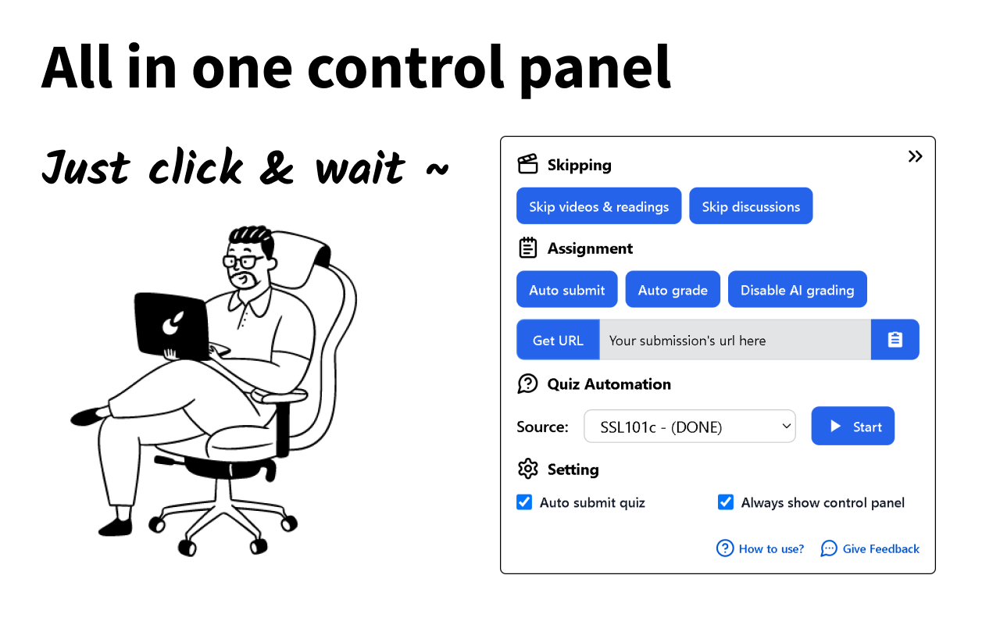
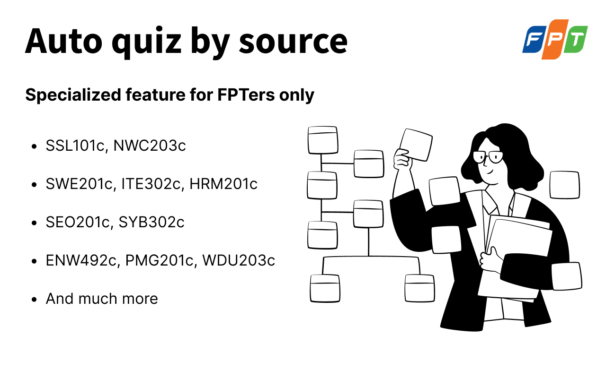

# 🎓 Coursera Tool Extension


A small helper for Coursera learners — designed **for educational purposes only**.

> ⚠️ _Don’t misuse this for official work or certificates. Do it by yourself if it really matters._

## 🚀 Features

- 📑 **Auto-complete** all videos and reading sections
- 💯 **Gemini Auto-answer** quizzes _(WIP – may not be 100% accurate)_
- 🧑 **Auto-submit** peer-graded assignments _(sometimes may fail)_
- 📋 **One-click** copy of your submission link
- ✅ **Auto-grade** the highest score for peer submissions
- 🤖 **Switch** your submission from AI grading to peer grading

> ⚠️ Auto-quiz might not always provide the correct answers and Auto-submit might not always work.

## 📦 Installation (Manual only)

This extension is not available on the Chrome Web Store or Edge Add-ons. Install it manually:

### Option A — Load the prebuilt folder
1. Download/cl one this repository.
2. Go to the `coursera/build-production` folder (already built in this repo).
3. Open your browser’s extension page:
   - Chrome: `chrome://extensions`
   - Edge: `edge://extensions`
4. Turn on **Developer mode**.
5. Click **Load unpacked** and select the `build-production` folder.

### Option B — Build locally then load
1. Ensure Node.js >= 14.18 is installed.
2. In the `coursera` folder, run:
   ```bash
   npm install
   npm run build
   ```
3. Load the generated `build-production` folder as an unpacked extension (steps 3–5 above).

## 🧭 Usage

1. Open any Coursera course page.
2. Click the floating round button to open the control panel.
3. For quiz automation, enter your Gemini API key in the `Gemini API` field and press **Test**.
4. Click **Start** to begin auto-quiz. Use other buttons for skipping videos/readings, discussions, assignment helpers, and copying your submission URL.

## 🖼 Preview



## 😱 Feature For FPTers only



## 🐞 Report an Issue

If you encounter a bug, have a suggestion, or want to request a new feature, please open an issue on GitHub or DM [me](https://github.com/VyyKa)

---

_From FPT with ❤️_
